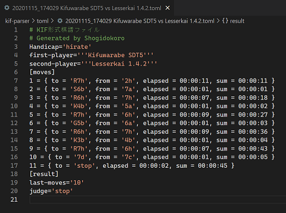
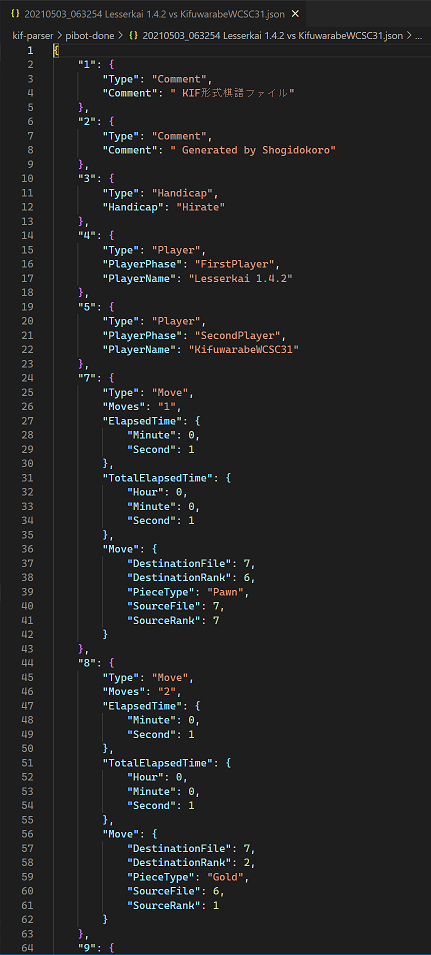

# kif-parser

WIP .KIF file (Shogi format) Parser, Converter.  

**DANGER:** このパーサーは、このプロジェクトの各📂フォルダーに入れたファイルを壊し得ます。棋譜ファイルはバックアップを取って使ってください。  

  

  
👆　.toml file (Convert: .kif -> .kifu -> PIVOT -> toml), Work in progress  

  
👆　.kif file (Convert: kif ←→ kifu), (kif → PIVOT)  

  
👆　.kifu file (Convert: kifu ←→ kif), (kifu → PIVOT)  

  
👆　PIVOT (.json file. Unofficial format, Not permanent save format. Work in progress)  

## KIF から KIFU へ変換

1. 📂`input` フォルダーに 📄`*.kif` ファイルをたくさん入れてください
2. ターミナルで `python.exe kif_to_kifu.py` コマンドを実行してください
3. UTF-8形式に変換して 📂`output` へ 📄`*.kifu` が出力されます
4. ゴミファイルが溜まっているので消すために、`python.exe remove_all.py` コマンドを実行してください

## KIFU から KIF へ変換

1. 📂`input` フォルダーに 📄`*.kifu` ファイルをたくさん入れてください
2. ターミナルで `python.exe kifu_to_kif.py` コマンドを実行してください
3. Shift-JIS形式に変換して 📂`output` へ 📄`*.kif` が出力されます
4. ゴミファイルが溜まっているので消すために、`python.exe remove_all.py` コマンドを実行してください

## KIF から PIVOT へ変換

1. 📂`input` フォルダーに `*.kif` ファイルをたくさん入れてください
2. ターミナルで `python.exe kif_to_pivot.py` コマンドを実行してください
3. JSON形式に変換して 📂`output` へ 📄`*.json` （PIVOT）が出力されます
   PIVOT ファイル形式は永続保存に適しません。使い終わったら削除しましょう
4. ゴミファイルが溜まっているので消すために、`python.exe remove_all.py` コマンドを実行してください
## KIFU から PIVOT へ変換

1. 📂`input` フォルダーに `*.kifu` ファイルをたくさん入れてください
2. ターミナルで `python.exe kifu_to_pivot.py` コマンドを実行してください
3. JSON形式に変換して 📂`output` へ 📄`*.json` （PIVOT）が出力されます
   PIVOT ファイル形式は永続保存に適しません。使い終わったら削除しましょう
4. ゴミファイルが溜まっているので消すために、`python.exe remove_all.py` コマンドを実行してください

## PIVOT から KIF へ変換

1. 📂`input` フォルダーに `*.json` 形式のPIVOTファイルをたくさん入れてください
2. ターミナルで `python.exe pivot_to_kif.py` コマンドを実行してください
3. KIF形式に変換して 📂`output` へ 📄`*.kif` が出力されます
   PIVOT ファイル形式は永続保存に適しません。使い終わったら削除しましょう
4. ゴミファイルが溜まっているので消すために、`python.exe remove_all.py` コマンドを実行してください

## PIVOT から KIFU へ変換

1. 📂`input` フォルダーに `*.json` 形式のPIVOTファイルをたくさん入れてください
2. ターミナルで `python.exe pivot_to_kifu.py` コマンドを実行してください
3. KIFU形式に変換して 📂`output` へ 📄`*.kifu` が出力されます
   PIVOT ファイル形式は永続保存に適しません。使い終わったら削除しましょう
4. ゴミファイルが溜まっているので消すために、`python.exe remove_all.py` コマンドを実行してください

## 棋譜ファイルを全部消す

指定のフォルダーの中のものは、棋譜ファイル以外も削除されるかもしれませんので、  
指定のフォルダーには壊されたくないものは置かないでください  

1. 注意。消えると困るオリジナルの棋譜ファイルは 別のところに保存しておいてください
2. ターミナルで `python.exe remove_all.py` コマンドを実行してください
3. 📂`temporary/kif_d` フォルダーの中の 📄`*.kif` ファイルは削除されます
4. 📂`temporary/kif-done_d` フォルダーの中の 📄`*.kif` ファイルは削除されます
5. 📂`temporary/kifu_d` フォルダーの中の 📄`*.kifu` ファイルは削除されます
6. 📂`temporary/kifu-done_d` フォルダーの中の 📄`*.kifu` ファイルは削除されます
7. 📂`temporary/pivot_d` フォルダーの中の 📄`*.json` ファイルは削除されます
8. 📂`temporary/pivot-done_d` フォルダーの中の 📄`*.json` ファイルは削除されます
9. 📂`temporary/toml_d` フォルダーの中の 📄`*.toml` ファイルは削除されます
10. 📂`toml-done` フォルダーの中の 📄`*.toml` ファイルは削除されます

## 出力ファイルを全部消す

📂`output` フォルダーに、消されてこまるファイルを置かないでください  

2. ターミナルで `python.exe remove_all_output.py` コマンドを実行してください
3. 📂`output` フォルダーの中の 📄`*.kif` ファイルは削除されます
5. 📂`output` フォルダーの中の 📄`*.kifu` ファイルは削除されます
7. 📂`output` フォルダーの中の 📄`*.json` ファイルは削除されます
9. 📂`output` フォルダーの中の 📄`*.toml` ファイルは削除されます

## temporary/kif-done_d フォルダーから kif フォルダーへファイルを逆移動

1. 注意。消えると困るオリジナルの棋譜ファイルは 別のところに保存しておいてください
2. 注意。これは壊れたファイルを元に戻す機能では **ありません**
3. ターミナルで `python.exe undo_kif.py` コマンドを実行してください
4. 📂`temporary/kifu-done_d` フォルダーにあるファイルが 📂`kifu` へ移動します

## Documents

📖　[KIF形式を調べようぜ（＾～＾）？](https://crieit.net/drafts/6150ffc21e0de)  
📖　[将棋の符号](https://crieit.net/drafts/615192ae93d14)  

## 開発者用

### 動作テスト .kif変換

(Copy: input->kif) (Convert: kif->kifu->pivot)、(Convert: pivot->kifu->kif) 変換が壊れていないかテストします  

1. 📂`input` フォルダーに 📄`*.kif` ファイルをたくさん入れてください
2. ターミナルで `python.exe test_kif.py` コマンドを実行してください
3. 変換が壊れていれば、標準出力にメッセージが出ます。問題がなければメッセージは出力されません
4. ゴミファイルが溜まっているので消すために、`python.exe remove_all.py` コマンドを実行してください

### 動作テスト .kifu変換

(Copy: input->kifu) (Convert kifu->pivot)、(Convert: pivot->kifu) 変換が壊れていないかテストします  

1. 📂`input` に `*.kifu` ファイルをたくさん入れてください
2. ターミナルで `python.exe test_kifu.py` コマンドを実行してください
3. 変換が壊れていれば、標準出力にメッセージが出ます。問題がなければメッセージは出力されません
4. ゴミファイルが溜まっているので消すために、`python.exe remove_all.py` コマンドを実行してください
