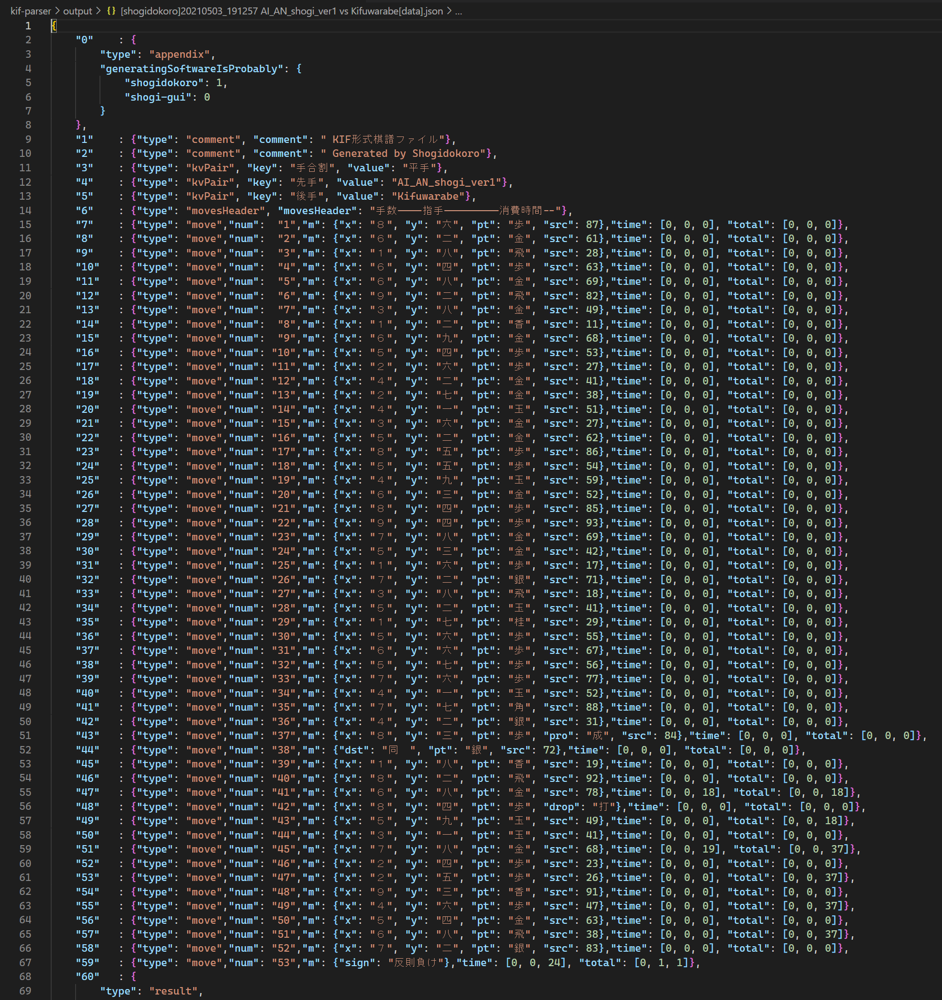

# kif-parser

WIP 作業中です。  

  

* 📖　[.kifファイルの問題点の洗い出し](./docs/research.md)
* 📖　[.kifファイルの利用実態の調査](./docs/examples)
* .KIF に変わる棋譜保存フォーマット仕様の提案、および　その変換アルゴリズム。
* 📖　[.kifファイルの国際化に向けた翻訳について](./docs/translation.md)
* 📖　[kif-parser の展望](./docs/vision.md)  
* 📖　[kif-parser 開発者向けドキュメント](./docs/developer.md)  

## Set up - このスクリプトの使い方

初めに注意。  
棋譜ファイルは別にバックアップを残しておいてください。  
このアプリケーションでは、棋譜ファイルのコピーを利用してください。  

**Python 3** を使いこなすスキルがあるものとします。  

## KIF から KIFU へ変換（またその逆）

1. 📂`input` フォルダーに 📄`*.kif` ファイルをたくさん入れてください
2. ターミナルで `python.exe kif_to_kifu.py` コマンドを実行してください
3. 📄`input/*.kif` は UTF-8形式に変換して 📂`output` へ 📄`*.kifu` が出力されます

同様に、逆の操作として `python.exe kifu_to_kif.py` というコマンドがあります  

## KIF から PIVOT へ変換

1. 📂`input` フォルダーに `*.kif` ファイルをたくさん入れてください
2. ターミナルで `python.exe kif_to_pivot.py` コマンドを実行してください
3. JSON形式に変換して 📂`output` へ 📄`*[data].json` （PIVOT）が出力されます

同様に、逆の操作として `python.exe kifu_to_pivot.py` というコマンドがあります

## PIVOT から KIF へ変換

1. 📂`input` フォルダーに `*[data].json` 形式のPIVOTファイルをたくさん入れてください
2. ターミナルで `python.exe pivot_to_kif.py` コマンドを実行してください
3. KIF形式に変換して 📂`output` へ 📄`*.kif` が出力されます

同様に、逆の操作として `python.exe pivot_to_kifu.py` というコマンドがあります

## Other site documents

📖　[棋譜ファイル KIF 形式](http://kakinoki.o.oo7.jp/kif_format.html) - オリジナルである柿木将棋での仕様  
📖　[分岐棋譜→単一棋譜変換プログラム](http://www.hakusa.net/computer/free/kifuconv.html) - 白砂 青松によるオリジナルにはない「変化」の説明。2004年  
📖　[KIF形式を調べようぜ（＾～＾）？](https://crieit.net/drafts/6150ffc21e0de)  
📖　[将棋の符号](https://crieit.net/drafts/615192ae93d14)  
📖　[Kif](https://lishogi.org/explanation/kif) - lishogiによる KIFフォーマットの説明  
