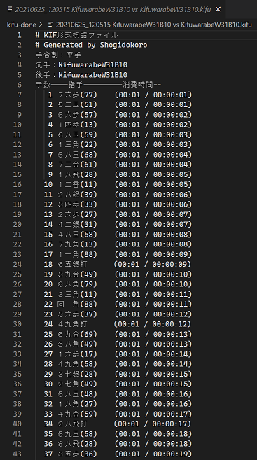

# kif-parser

WIP KIFパーサー、コンバーター  

  
👆　.kif file (kif ←→ kifu), (kif → PIBOT)  

  
👆　.kifu file (kifu ←→ kif), (kifu → PIBOT)  

  
👆　PIBOT (.json file. Unofficial format. Work in progress)  

## KIF から KIFU へ変換

1. 注意。消えると困るオリジナルの棋譜ファイルは 別のところに保存しておいてください
2. 📂`kif` に `*.kif` ファイルをたくさん入れてください
3. ターミナルで `python.exe kif_to_kifu.py` コマンドを実行してください
4. UTF-8形式に変換して 📂`kifu` ファイルに変換されます
5. 読み終えた `kif/*.kif` ファイルは、 `kif-done/*.kif` へ移動されます

## KIFU から KIF へ変換

1. 注意。消えると困るオリジナルの棋譜ファイルは 別のところに保存しておいてください
2. 📂`kifu` に `*.kifu` ファイルをたくさん入れてください
3. ターミナルで `python.exe kifu_to_kif.py` コマンドを実行してください
4. Shift-JIS形式に変換して 📂`kif` ファイルに変換されます
5. 読み終えた `kifu/*.kifu` ファイルは、 `kifu-done/*.kifu` へ移動されます

## KIF から PIBOT へ変換

1. 注意。消えると困るオリジナルの棋譜ファイルは 別のところに保存しておいてください
2. 📂`kif` に `*.kif` ファイルをたくさん入れてください
3. ターミナルで `python.exe kif_to_pibot.py` コマンドを実行してください
4. JSON形式に変換して 📂`pibot` ファイルに変換されます
5. 読み終えた `kif/*.kif` ファイルは、 `kif-done/*.kif` へ移動されます
6. PIBOT ファイル形式は永続保存に適しません。使い終わったら削除しましょう

## KIFU から PIBOT へ変換

1. 注意。消えると困るオリジナルの棋譜ファイルは 別のところに保存しておいてください
2. 📂`kifu` に `*.kifu` ファイルをたくさん入れてください
3. ターミナルで `python.exe kifu_to_pibot.py` コマンドを実行してください
4. JSON形式に変換して 📂`pibot` ファイルに変換されます
5. 読み終えた `kifu/*.kifu` ファイルは、 `kifu-done/*.kifu` へ移動されます
6. PIBOT ファイル形式は永続保存に適しません。使い終わったら削除しましょう

## Documents

📖　[KIF形式を調べようぜ（＾～＾）？](https://crieit.net/drafts/6150ffc21e0de)  
📖　[将棋の符号](https://crieit.net/drafts/615192ae93d14)  
