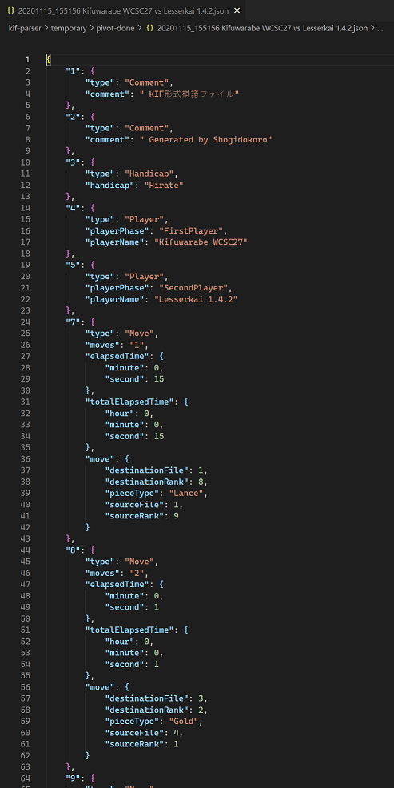

# kif-parser

作業中です。 .KIF （本将棋の棋譜形式）ファイルの利用実態の調査、 問題点の洗い出し、 .KIF に変わる棋譜保存フォーマット仕様の提案、および　その変換アルゴリズム。  

## Overview - 全体図

  

* どの形式のファイルも、 PIVOT （中間）ファイルに変換できるものとし、また、 PIVOT から元の形式に戻せるものとします
  * ただし `.kif` ファイルは PIVOT に直接変換せず、 `.kifu` 変換を経由するものとします

## Research - 調査

### .kif

  
👆 `.kif` ファイル。 文字エンコーディングが Shift-JIS なので国際化に向きません。国産の既存のGUIで普及しています。  
**このファイルをテキストエディターで直接編集している利用者はほぼ居らず、ShogiGUIなどのソフトへ入力、出力するだけと聞きます**  

また、桁ぞろえや 前ゼロなど 表記は、 **ソフトによって異なります**  

`.kif` 形式を使っているソフトの例:  

* [柿木将棋](http://kakinoki.o.oo7.jp/) - .kif 形式のオリジナル。 しかし「変化」手順は仕様にありません
* [将棋所](http://shogidokoro.starfree.jp/)
* [Shogi GUI](http://shogigui.siganus.com/)
* [将棋ウォーズ](https://shogiwars.heroz.jp/?locale=ja)

`.kif` 形式のファイルを配布しているサイトの例:  

* [floodgate](http://wdoor.c.u-tokyo.ac.jp/shogi/floodgate.html)
* [世界コンピュータ将棋選手権](http://www2.computer-shogi.org/)
* [将棋電王トーナメント](https://denou.jp/tournament2017/)
* [世界将棋AI 電竜戦](https://denryu-sen.jp/)

### .kifu

  
👆 `.kifu` ファイル。 `.kif` を UTF-8 に変換したファイルです。国産の既存のGUIで普及していません。  
将棋は日本が最大のユーザー数ですから、自然、まだ普及していません  

## Proposal - 提案

一番困っているのは、これから新しく GUI や、関連ソフトを作ろうとしている新規の GUI 開発者側の人です。  
もうGUIを作った人、将棋を指す人、観る人、思考エンジンを作る人は困っていません。  

そこで 2021年現在、人気の高いプログラム言語の Python, Java Script で標準で実装されている JSON ファイル形式を  
中心に据え直し、 `.kif` へエクスポートできるアルゴリズムを Work in progress (作業中)です。  

### .json

  
👆 `.json` ファイル。 仕様は未定

意味解析せず、 `.kif` の１行１行を **直訳** したもの。  
単一行コメントを どの行、どの文末にも置けることから、  
このコメントが上に係っているのか　下に係っているのか　機械的に判断できないため。  

### .toml

また、もっと ハードコアな開発者向けに、 `.toml` 形式も先行して準備します。  
コメント、文字列型、ヒアドキュメント、整数型、浮動小数点型、時刻型やリスト、連想配列など プログラマー寄りの設定ファイル形式です  

  
👆 `.toml` ファイル。 仕様は未定。  

## Set up

```shell
# もし、 .kif を .toml に変換したいなら
pip install tomli
```


## KIF から KIFU へ変換

1. 📂`input` フォルダーに 📄`*.kif` ファイルをたくさん入れてください
2. ターミナルで `python.exe kif_to_kifu.py` コマンドを実行してください
3. UTF-8形式に変換して 📂`output` へ 📄`*.kifu` が出力されます
4. ゴミファイルが溜まっているので消すために、`python.exe remove_all_temporary.py` コマンドを実行してください

## KIFU から KIF へ変換

1. 📂`input` フォルダーに 📄`*.kifu` ファイルをたくさん入れてください
2. ターミナルで `python.exe kifu_to_kif.py` コマンドを実行してください
3. Shift-JIS形式に変換して 📂`output` へ 📄`*.kif` が出力されます
4. ゴミファイルが溜まっているので消すために、`python.exe remove_all_temporary.py` コマンドを実行してください

## KIF から PIVOT へ変換

1. 📂`input` フォルダーに `*.kif` ファイルをたくさん入れてください
2. ターミナルで `python.exe kif_to_pivot.py` コマンドを実行してください
3. JSON形式に変換して 📂`output` へ 📄`*.json` （PIVOT）が出力されます
   PIVOT ファイル形式は永続保存に適しません。使い終わったら削除しましょう
4. ゴミファイルが溜まっているので消すために、`python.exe remove_all_temporary.py` コマンドを実行してください
## KIFU から PIVOT へ変換

1. 📂`input` フォルダーに `*.kifu` ファイルをたくさん入れてください
2. ターミナルで `python.exe kifu_to_pivot.py` コマンドを実行してください
3. JSON形式に変換して 📂`output` へ 📄`*.json` （PIVOT）が出力されます
   PIVOT ファイル形式は永続保存に適しません。使い終わったら削除しましょう
4. ゴミファイルが溜まっているので消すために、`python.exe remove_all_temporary.py` コマンドを実行してください

## PIVOT から KIF へ変換

1. 📂`input` フォルダーに `*.json` 形式のPIVOTファイルをたくさん入れてください
2. ターミナルで `python.exe pivot_to_kif.py` コマンドを実行してください
3. KIF形式に変換して 📂`output` へ 📄`*.kif` が出力されます
   PIVOT ファイル形式は永続保存に適しません。使い終わったら削除しましょう
4. ゴミファイルが溜まっているので消すために、`python.exe remove_all_temporary.py` コマンドを実行してください

## PIVOT から KIFU へ変換

1. 📂`input` フォルダーに `*.json` 形式のPIVOTファイルをたくさん入れてください
2. ターミナルで `python.exe pivot_to_kifu.py` コマンドを実行してください
3. KIFU形式に変換して 📂`output` へ 📄`*.kifu` が出力されます
   PIVOT ファイル形式は永続保存に適しません。使い終わったら削除しましょう
4. ゴミファイルが溜まっているので消すために、`python.exe remove_all_temporary.py` コマンドを実行してください

## 棋譜ファイルを全部消す

指定のフォルダーの中のものは、棋譜ファイル以外も削除されるかもしれませんので、  
指定のフォルダーには壊されたくないものは置かないでください  

1. 注意。消えると困るオリジナルの棋譜ファイルは 別のところに保存しておいてください
2. ターミナルで `python.exe remove_all_temporary.py` コマンドを実行してください
3. 📂`temporary/kif` フォルダーの中の 📄`*.kif` ファイルは削除されます
4. 📂`temporary/kif-done` フォルダーの中の 📄`*.kif` ファイルは削除されます
5. 📂`temporary/kifu` フォルダーの中の 📄`*.kifu` ファイルは削除されます
6. 📂`temporary/kifu-done` フォルダーの中の 📄`*.kifu` ファイルは削除されます
7. 📂`temporary/pivot` フォルダーの中の 📄`*.json` ファイルは削除されます
8. 📂`temporary/pivot-done` フォルダーの中の 📄`*.json` ファイルは削除されます
9. 📂`temporary/toml` フォルダーの中の 📄`*.toml` ファイルは削除されます
10. 📂`temporary/toml-done` フォルダーの中の 📄`*.toml` ファイルは削除されます

## 出力ファイルを全部消す

📂`output` フォルダーに、消されてこまるファイルを置かないでください  

1. ターミナルで `python.exe remove_all_output.py` コマンドを実行してください
2. 📂`output` フォルダーの中の 📄`*.kif` ファイルは削除されます
3. 📂`output` フォルダーの中の 📄`*.kifu` ファイルは削除されます
4. 📂`output` フォルダーの中の 📄`*.json` ファイルは削除されます
5. 📂`output` フォルダーの中の 📄`*.toml` ファイルは削除されます

## temporary/kif-done フォルダーから kif フォルダーへファイルを逆移動

1. 注意。消えると困るオリジナルの棋譜ファイルは 別のところに保存しておいてください
2. 注意。これは壊れたファイルを元に戻す機能では **ありません**
3. ターミナルで `python.exe undo_kif.py` コマンドを実行してください
4. 📂`temporary/kifu-done` フォルダーにあるファイルが 📂`kifu` へ移動します

# 開発者用

## 動作テスト .kif変換

(Copy: input->kif) (Convert: kif->kifu->pivot)、(Convert: pivot->kifu->kif) 変換が壊れていないかテストします  

1. 📂`input` フォルダーに 📄`*.kif` ファイルをたくさん入れてください
2. ターミナルで `python.exe test_kif.py` コマンドを実行してください
3. 変換が壊れていれば、標準出力にメッセージが出ます。問題がなければメッセージは出力されません
4. ゴミファイルが溜まっているので消すために、`python.exe remove_all_temporary.py` コマンドを実行してください

## 動作テスト .kifu変換

(Copy: input->kifu) (Convert kifu->pivot)、(Convert: pivot->kifu) 変換が壊れていないかテストします  

1. 📂`input` に `*.kifu` ファイルをたくさん入れてください
2. ターミナルで `python.exe test_kifu.py` コマンドを実行してください
3. 変換が壊れていれば、標準出力にメッセージが出ます。問題がなければメッセージは出力されません
4. ゴミファイルが溜まっているので消すために、`python.exe remove_all_temporary.py` コマンドを実行してください

## デバッグモード

コマンドライン引数に `-h` を付けて、ヘルプがあるものは何か用意がある。引数に `--debug` を付けるとデバッグモード。  

## 危険な操作 - 入力ファイルを全部消す

**DANGER** 📂`input` フォルダーの中身を消すコマンドです  

1. ターミナルで `python.exe remove_all_input_danger.py` コマンドを実行してください
2. 📂`input` フォルダーの中の 📄`*.kif` ファイルは削除されます
3. 📂`input` フォルダーの中の 📄`*.kifu` ファイルは削除されます
4. 📂`input` フォルダーの中の 📄`*.json` ファイルは削除されます
5. 📂`input` フォルダーの中の 📄`*.toml` ファイルは削除されます

## 危険な操作 - 出力フォルダーの内容を、入力フォルダーへ移動

**DANGER** 📂`input` フォルダーの中身を上書きするコマンドです  

1. ターミナルで `python.exe move_output_to_input_danger.py` コマンドを実行してください
2. 📂`output` フォルダーの中の (📄`*.kif`, 📄`*.kifu`, 📄`*.json`, 📄`*.toml`)ファイルを 📂`input` へ移動します

## 危険な操作 - テストデータ フォルダーの内容を、入力フォルダーへコピー

**DANGER** 📂`input` フォルダーの中身を上書きするコマンドです  

1. ターミナルで `python.exe copy_test_data_to_input_danger.py` コマンドを実行してください
2. 📂`test_data` フォルダーの中の (📄`*.kif`, 📄`*.kifu`, 📄`*.json`, 📄`*.toml`)ファイルを 📂`input` へコピーします

## 開発者向け PIVOT 仕様

### row_type - 行の型

|行の型|説明|
|---|---|
|comment|コメント行|
|explanation|指し手へのコメント行|
|bookmark|しおり|
|player|対局者の手番、対局者名行|
|variationLabel|変化手順のジャンプ先ラベル|
|result|どちらの勝ち、といった終局時のメッセージ行。盤面作成時などには無いこともある|

## Documents

📖　[棋譜ファイル KIF 形式](http://kakinoki.o.oo7.jp/kif_format.html) - オリジナルである柿木将棋での仕様  
📖　[分岐棋譜→単一棋譜変換プログラム](http://www.hakusa.net/computer/free/kifuconv.html) - オリジナルにはない「変化」の説明  
📖　[KIF形式を調べようぜ（＾～＾）？](https://crieit.net/drafts/6150ffc21e0de)  
📖　[将棋の符号](https://crieit.net/drafts/615192ae93d14)  
