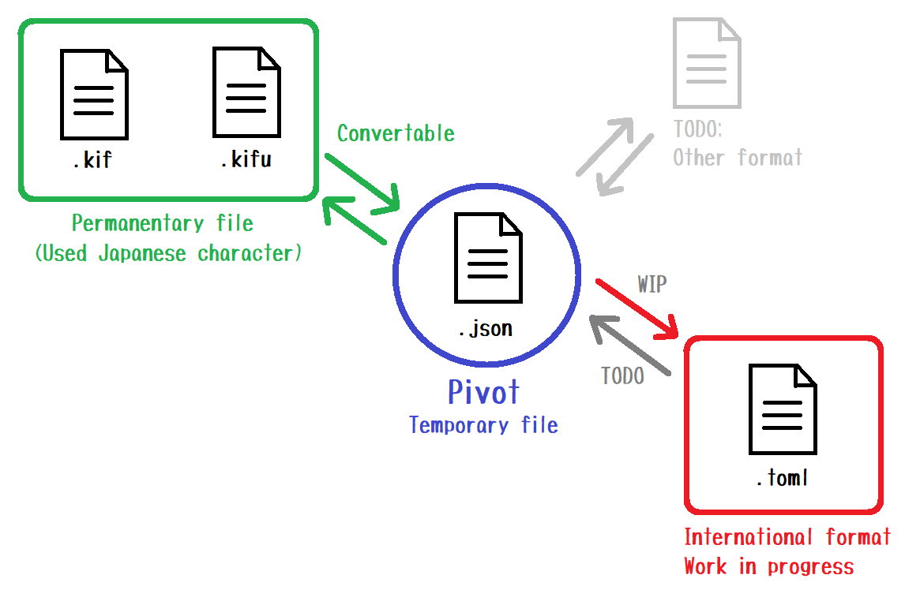
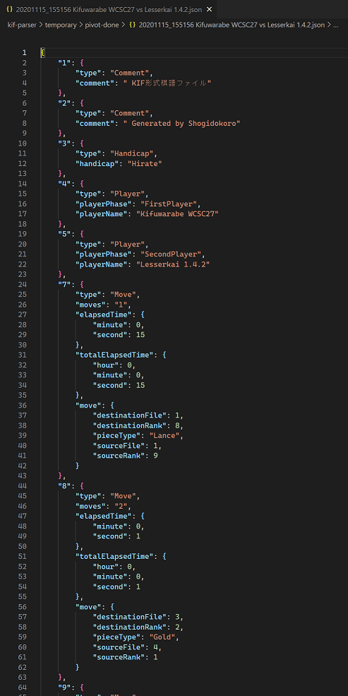
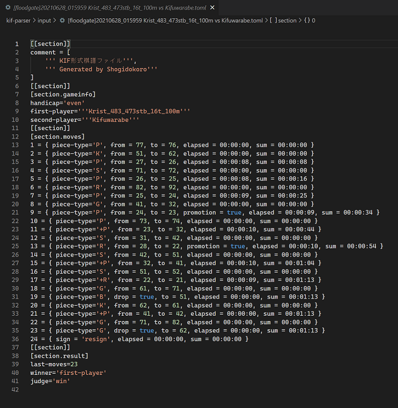

# Vision - 展望

## Overview - 全体図

  

* どの形式のファイルも、 PIVOT （中間）ファイルに変換できるものとし、また、 PIVOT から元の形式に戻せるものとします
  * ただし `.kif` ファイルは PIVOT に直接変換せず、 `.kifu` 変換を経由するものとします

## Proposal - 提案

そこで 2021年現在、人気の高いプログラム言語の Python, Java Script で標準で実装されている JSON ファイル形式を  
中心に据え直し、 `.kif` へエクスポートできるアルゴリズムを Work in progress (作業中)です。  

### .json

  
👆 `.json` ファイル。 仕様は未定

意味解析せず、 `.kif` の１行１行を **直訳** したもの。  
単一行コメントを どの行、どの文末にも置けることから、  
このコメントが上に係っているのか　下に係っているのか　機械的に判断できないため。  

また、 どのソフトから読み取った `.kif` ファイルなのか類推して情報として付加しておくと  
開発時のテストで役に立つかもしれません。  

### .toml

また、もっと ハードコアな開発者向けに、 `.toml` 形式も先行して準備します。  
コメント、文字列型、ヒアドキュメント、整数型、浮動小数点型、時刻型やリスト、連想配列など プログラマー寄りの設定ファイル形式です  

  
👆 `.toml` ファイル。 仕様は未定。  
